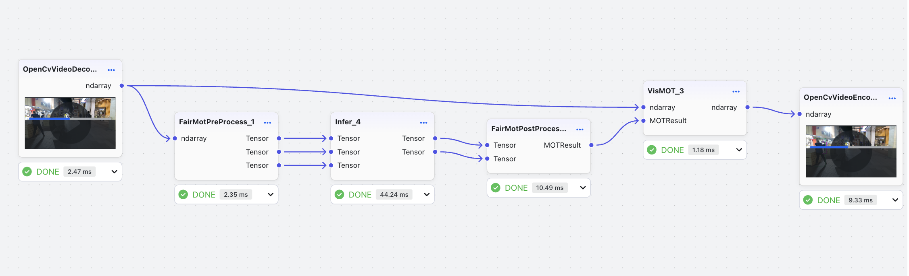
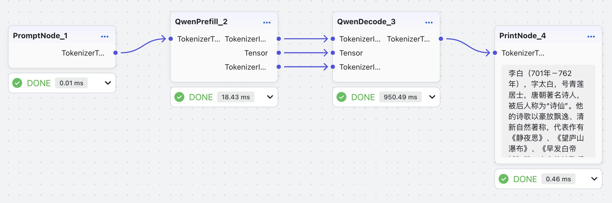
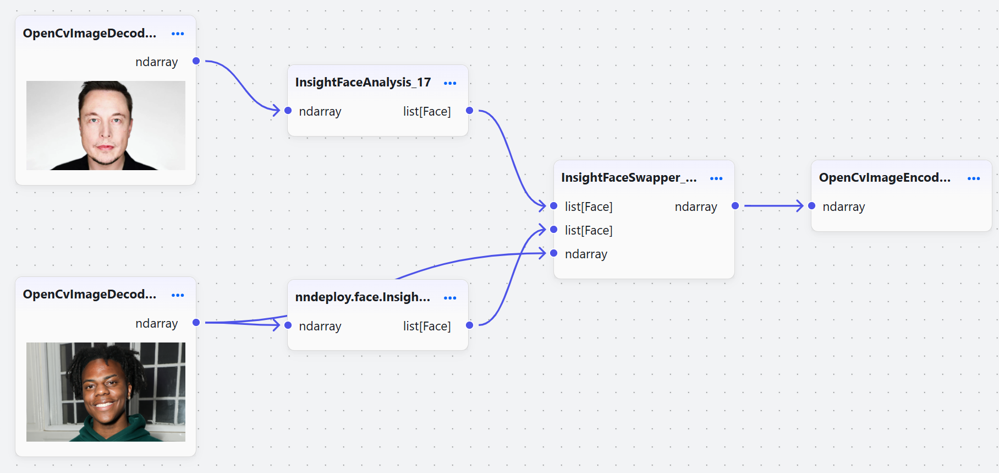

# nndeploy工作流

## 目标检测

### 模型准备

前往[模型仓库](https://modelscope.cn/models/nndeploy/nndeploy/summary)拉取模型文件，模型位于nndeploy/detect目录下。

### 工作流

下载[detect/yolo.json](detect/yolo.json)工作流文件，通过前端工作流的上传功能上传文件后，即可看见工作流。

<p align="left">
  <picture>
    
  </picture>
</p>

### 参数配置

参数配置主要包括：输入、输出节点文件路径配置，前后节点的参数配置，推理节点的参数配置。工作流文件已经对大部分参数进行配置，用户仅需要修改以下参数：

#### OpenCvImageDecode

`path_`：输入图片的路径

#### OpenCvImageEncode

`path_`：输出图片的路径

#### Infer

`param_/model_type_`：模型文件的类型

`param_/model_value_`：模型文件的路径

`param_/device_type_`：设备类型

## 目标追踪

### 模型准备

前往[模型仓库](https://modelscope.cn/models/nndeploy/nndeploy/summary)拉取模型文件，模型位于nndeploy/track目录下。

### 工作流

下载[track/track.json](track/track.json)工作流文件，通过前端工作流的上传功能上传文件后，即可看见工作流。

<p align="left">
  <picture>
    
  </picture>
</p>

### 参数配置

参数配置主要包括：输入、输出节点文件路径配置，前后节点的参数配置，推理节点的参数配置。工作流文件(yolov5n/s/m/l)已经对大部分参数进行配置，用户仅需要修改以下参数：

#### OpenCvVideoDecode

`path_`：输入视频的路径

#### OpenCvVideoEncode

`path_`：输出视频的路径

#### Infer

`param_/model_type_`：模型文件的类型

`param_/model_value_`：模型文件的路径

`param_/device_type_`：设备类型

## 目标分割

### 模型准备

前往[模型仓库](https://modelscope.cn/models/nndeploy/nndeploy/summary)拉取模型文件，模型位于nndeploy/segment目录下。

### 工作流

下载[segment/rmbg.json](segment/rmbg.json)工作流文件，通过前端工作流的上传功能上传文件后，即可看见工作流。

<p align="left">
  <picture>
    
  </picture>
</p>

### 参数配置

参数配置主要包括：输入、输出节点文件路径配置，前后节点的参数配置，推理节点的参数配置。工作流文件已经对大部分参数进行配置，用户仅需要修改以下参数：

#### OpenCvImageDecode

`path_`：输入图片的路径

#### OpenCvImageEncode

`path_`：输出图片的路径

#### Infer

`param_/model_type_`：模型文件的类型

`param_/model_value_`：模型文件的路径

`param_/device_type_`：设备类型

## 文生图

### 模型准备

前往[模型仓库](https://modelscope.cn/models/nndeploy/nndeploy/summary)拉取模型文件，模型位于nndeploy/stable_diffusion/目录下。

### 工作流

下载[stable_diffusion/stable_diffusion_1.5.json](stable_diffusion/stable_diffusion_1.5.json)工作流文件，通过前端工作流的上传功能上传文件后，即可看见工作流。

<p align="left">
  <picture>
    
  </picture>
</p>

### 参数配置

### InitTokenText_0

`prompt_`：正向提示词（token长度限制为77）

### InitTokenText_1

`prompt_`：逆向提示词（token长度限制为77）

### TokenizerEncodeCpp_3

`param_/json_blob_`：tokenizer.json文件的路径

### TokenizerEncodeCpp_4

`param_/json_blob_`：tokenizer.json文件的路径

### Infer_7

`param_/model_type_`：模型文件的类型

`param_/model_value_`：clip模型文件的路径

`param_/device_type_`：设备类型

### Infer_8

`param_/model_type_`：模型文件的类型

`param_/model_value_`：clip模型文件的路径

`param_/device_type_`：设备类型

### Denoise_11/unet_infer

`param_/model_type_`：模型文件的类型

`param_/model_value_`：unet模型文件的路径

`param_/external_model_data_`：fp32格式下权重文件的路径，fp16格式无需设置

`param_/device_type_`：设备类型（fp16需要设置类型为kDeviceTypeCodeCuda:0）

### Infer_13

`param_/model_type_`：模型文件的类型

`param_/model_value_`：vae decoder模型文件的路径

`param_/device_type_`：设备类型

### OpenCvImageEncode_1

`path_`：输出图片的路径

## 大语言模型

### 模型准备

前往[模型仓库](https://modelscope.cn/models/nndeploy/nndeploy/summary)拉取模型文件，模型位于nndeploy/qwen目录下。

### 工作流

下载[qwen/qwen-0.5B.json](qwen/qwen-0.5B.json)工作流文件，通过前端工作流的上传功能上传文件后，即可看见工作流。

<p align="left">
  <picture>
    
  </picture>
</p>

### 参数配置

#### PromptNode

`user_content_`：提示词

#### QwenPrefill

`config_path_`：配置文件路径

#### QwenDecode

`config_path_`：llm_config.json配置文件路径

#### QwenPrefill/prefill_infer

`external_model_data_`：onnx模型文件超过2GB时，权重和模型结构会分开存储，如llm.onnx和llm.onnx.data，该参数为权重文件路径。

#### QwenDecode/decode_infer

`external_model_data_`：onnx模型文件超过2GB时，权重和模型结构会分开存储，如llm.onnx和llm.onnx.data，该参数为权重文件路径。

### llm_config.json

```
{
    "hidden_size": 896,
    "layer_nums": 24,
    "max_seq_len": 250,
    "attention_mask": "float",
    "model_path": "/home/lds/model/onnx/llm.onnx",
    "embedding_file": "/home/lds/model/embeddings_bf16.bin",
    "tokenizer_json": "/home/lds/Qwen2-0.5B-Instruct/tokenizer.json",
    "tokenizer_txt": "/home/lds/model/tokenizer.txt",
    "key_value_shape": [
        2,
        1,
        0,
        2,
        64
    ],
    "prompt_template": "<|im_start|>user\n%s<|im_end|>\n<|im_start|>assistant\n",
    "prompt": "请介绍一下李白？",
    "is_visual": false
}
```

根据模型文件路径修改以下参数：

`model_path`：qwen模型文件路径

`embedding_file`：embedding模型文件路径

`tokenizer_json`：tokenizer文件路径

`tokenizer_txt`：tokenizer文件路径

## 换脸算法

### 模型准备

前往[模型仓库](https://modelscope.cn/models/nndeploy/nndeploy/summary)拉取模型文件，模型位于nndeploy/face_swap目录下。

### 安装python依赖

```bash
cd path/nndeploy-workflow/face_swap
pip install -r requirements.txt
```

### 工作流

下载[face_swap/face_swap.json](face_swap/face_swap.json)工作流文件，通过前端工作流的上传功能上传文件后，即可看见工作流。

<p align="left">
  <picture>
    
  </picture>
</p>

### 参数配置

参数配置主要包括：输入、输出节点文件路径配置，前后节点的参数配置，推理节点的参数配置。工作流文件已经对大部分参数进行配置，用户仅需要修改以下参数：

#### OpenCvImageDecode

`path_`：输入图片的路径

#### OpenCvImageEncode

`path_`：输出图片的路径

#### InsightFaceSwapper

`model_path_`：换脸模型文件

#### GFPGAN

`model_path_`：人脸清晰模型文件

