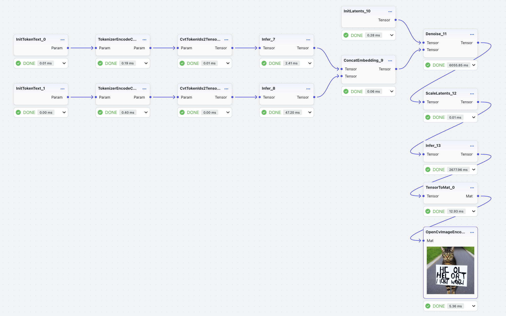

[简体中文](README_CN.md) | English

# nndeploy Workflow

## Object Detection

### Model Preparation

Go to the [Model Repository](https://modelscope.cn/models/nndeploy/nndeploy/summary) to pull the model files. The models are located in the `nndeploy/detect` directory.

### Workflow

Download the [detect/yolo.json](detect/yolo.json) workflow file. After uploading the file through the front - end workflow upload function, you can view the workflow.

  <picture>
    
  </picture>

### Parameter Configuration

Parameter configuration mainly includes: input and output node file path configuration, parameter configuration of front - and back - nodes, and parameter configuration of inference nodes. Most of the parameters have been configured in the workflow file. Users only need to modify the following parameters:

#### OpenCvImageDecode

`path_`: Path of the input image

#### OpenCvImageEncode

`path_`: Path of the output image

#### Infer

`param_/model_type_`: Type of the model file

`param_/model_value_`: Path of the model file

`param_/device_type_`: Device type

## Object Tracking

### Model Preparation

Go to the [Model Repository](https://modelscope.cn/models/nndeploy/nndeploy/summary) to pull the model files. The models are located in the `nndeploy/track` directory.

### Workflow

Download the [track/track.json](track/track.json) workflow file. After uploading the file through the front - end workflow upload function, you can view the workflow.

  <picture>
    
  </picture>

### Parameter Configuration

Parameter configuration mainly includes: input and output node file path configuration, parameter configuration of front - and back - nodes, and parameter configuration of inference nodes. Most of the parameters have been configured in the workflow files (yolov5n/s/m/l). Users only need to modify the following parameters:

#### OpenCvVideoDecode

`path_`: Path of the input video

#### OpenCvVideoEncode

`path_`: Path of the output video

#### Infer

`param_/model_type_`: Type of the model file

`param_/model_value_`: Path of the model file

`param_/device_type_`: Device type

## Object Segmentation

### Model Preparation

Go to the [Model Repository](https://modelscope.cn/models/nndeploy/nndeploy/summary) to pull the model files. The models are located in the `nndeploy/segment` directory.

### Workflow

Download the [segment/rmbg.json](segment/rmbg.json) workflow file. After uploading the file through the front - end workflow upload function, you can view the workflow.

  <picture>
    
  </picture>

### Parameter Configuration

Parameter configuration mainly includes: input and output node file path configuration, parameter configuration of front - and back - nodes, and parameter configuration of inference nodes. Most of the parameters have been configured in the workflow file. Users only need to modify the following parameters:

#### OpenCvImageDecode

`path_`: Path of the input image

#### OpenCvImageEncode

`path_`: Path of the output image

#### Infer

`param_/model_type_`: Type of the model file

`param_/model_value_`: Path of the model file

`param_/device_type_`: Device type

## Text-to-Image

### Model Preparation

Go to the [Model Repository](https://modelscope.cn/models/nndeploy/nndeploy/summary) to pull the model files. The models are located in the `nndeploy/stable_diffusion/` directory.

### Workflow

Download the [stable_diffusion/stable_diffusion_1.5.json](stable_diffusion/stable_diffusion_1.5.json) workflow file. After uploading the file through the front - end workflow upload function, you can view the workflow.

  <picture>
    
  </picture>

### Parameter Configuration

### InitTokenText_0

`prompt_`: Positive prompt (token length limit is 77)

### InitTokenText_1

`prompt_`: Negative prompt (token length limit is 77)

### TokenizerEncodeCpp_3

`param_/json_blob_`: Path of the `tokenizer.json` file

### TokenizerEncodeCpp_4

`param_/json_blob_`: Path of the `tokenizer.json` file

### Infer_7

`param_/model_type_`: Type of the model file

`param_/model_value_`: Path of the CLIP model file

`param_/device_type_`: Device type

### Infer_8

`param_/model_type_`: Type of the model file

`param_/model_value_`: Path of the CLIP model file

`param_/device_type_`: Device type

### Denoise_11/unet_infer

`param_/model_type_`: Type of the model file

`param_/model_value_`: Path of the UNet model file

`param_/external_model_data_`: Path of the weight file in FP32 format. No need to set for FP16 format.

`param_/device_type_`: Device type (For FP16, set the type to `kDeviceTypeCodeCuda:0`)

### Infer_13

`param_/model_type_`: Type of the model file

`param_/model_value_`: Path of the VAE decoder model file

`param_/device_type_`: Device type

### OpenCvImageEncode_1

`path_`: Path of the output image

## Large Language Model

### Model Preparation

Go to the [Model Repository](https://modelscope.cn/models/nndeploy/nndeploy/summary) to pull the model files. The models are located in the `nndeploy/qwen` directory.

### Workflow

Download the [qwen/qwen-0.5B.json](qwen/qwen-0.5B.json) workflow file. After uploading the file through the front - end workflow upload function, you can view the workflow.

  <picture>
    
  </picture>

### Parameter Configuration

#### PromptNode

`user_content_`: Prompt

#### QwenPrefill

`config_path_`: Path of the configuration file

#### QwenDecode

`config_path_`: Path of the `llm_config.json` configuration file

#### QwenPrefill/prefill_infer

`external_model_data_`: When the ONNX model file exceeds 2GB, the weights and model structure will be stored separately, such as `llm.onnx` and `llm.onnx.data`. This parameter is the path of the weight file.

#### QwenDecode/decode_infer

`external_model_data_`: When the ONNX model file exceeds 2GB, the weights and model structure will be stored separately, such as `llm.onnx` and `llm.onnx.data`. This parameter is the path of the weight file.

### llm_config.json
